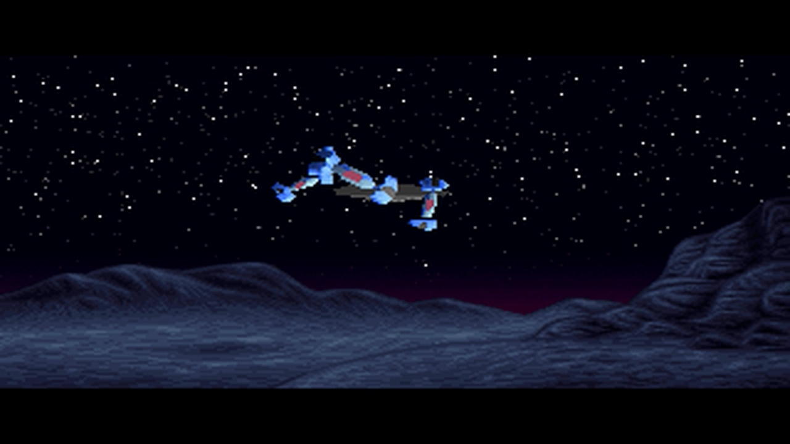

# Learning GLSL Fragement Shaders with Starfields

I love 80s- and early 90s-era graphical effects. I remember being blown away the first time I watched [Future Crew's Second reality](https://www.pouet.net/prod.php?which=63) on my 486. It inspired me to learn trig, dive into [Mode 13h](https://en.wikipedia.org/wiki/Mode_13h), Turbo Pascal, assembly language. The best I could muster was some basic perspective font scrolling and simple fire effects. (ToT)

|  |
|:--:|
| Scene from Second Reality |


OpenGL fragment shaders provide a fun way to get back into building some simple effects. Of course [one can build](https://iquilezles.org/articles/) incredible, [mind-blowing effects](https://www.shadertoy.com/view/ld3Gz2) in GLSL. I cannot, or at least I will not be doing that here. I'm going to build the simplest of effects: the basic starfield "warp" effect.

### What's in this repo
In this repo I build a simple 80s/90s starfield effect in a few different ways. I enjoy teaching. I also find that I think deeper about what I'm building if I have to explain it to others. So rather than just build this simple effect, I decided to write up the steps I took as sort of a tutorial.

### Why Fragment Shaders / Why a Starfield
Starfields are really simple effects. At its simplest it's just pixels randomly spawned near the center of the screen that animate towards the edge of the screen over time, giving the effect of motion.

[Fragment shaders](https://www.khronos.org/opengl/wiki/Fragment_Shader) are really interesting. They effectively run in parallel for every pixel on the screen. State can be passed into the shader from the calling program but it's more interesting (to me at least) to try and make the shader as stateless as possible.

The intersection of a starfield and a mostly stateless fragment shader creates an interesting problem. Without an array of star locations that we can update and render over time how do we create the effect such that each pixel can render in parallel given only the current time as an input. **This is what makes this fun.**

## Goal
We want to create an effect like [this screensaver](https://www.youtube.com/watch?v=KheYW_G0goY) from Windows 3.1...or maybe a little nicer.


## Approaches
I've explored two primary approaches:
1. [Radial](./radial) - approach the effect from a polar coordinate perspective
2. [Zoom](./zoom) - approach the effect using randomly rendered "layers" of stars that approach the camera using a zoom approach

During this exercise I heavily relied on the excellent [Book of Shaders](https://thebookofshaders.com/) - highly recommend.

## Running
To run the demos just serve this directory with a local webserver, such as:
```
npx http-server .
```
...and open your browser, typically to http://localhost:8080