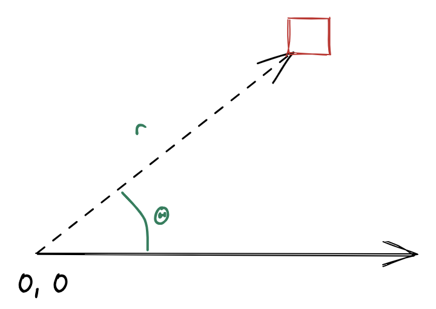
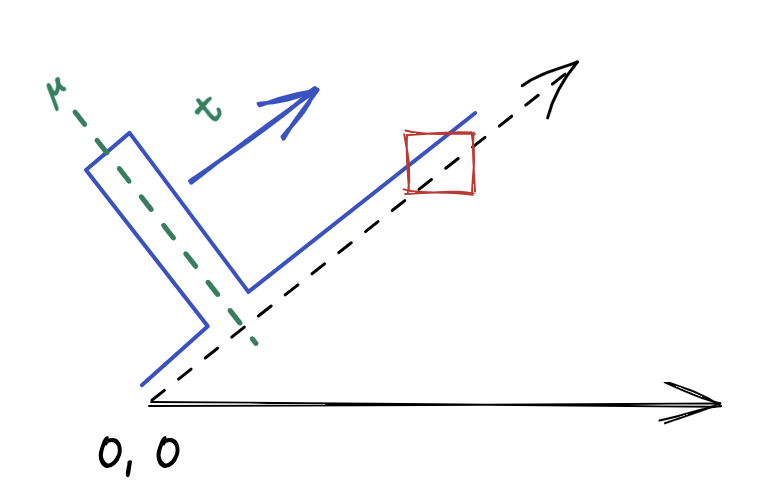
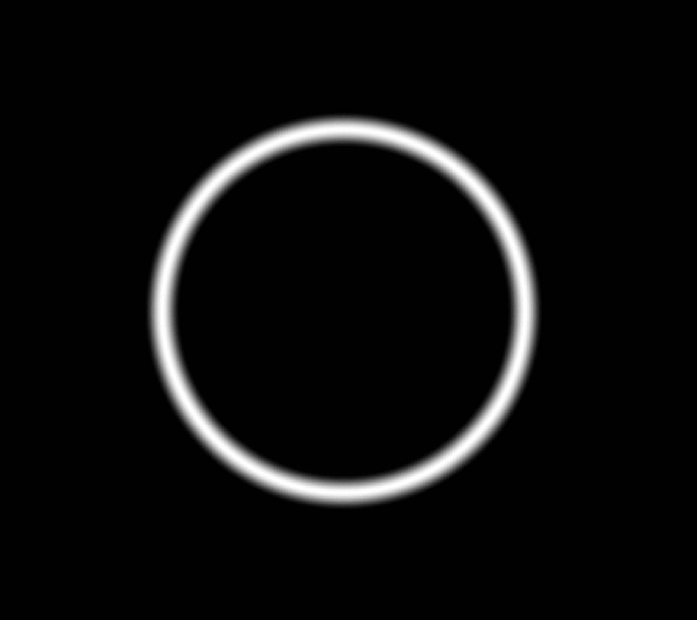
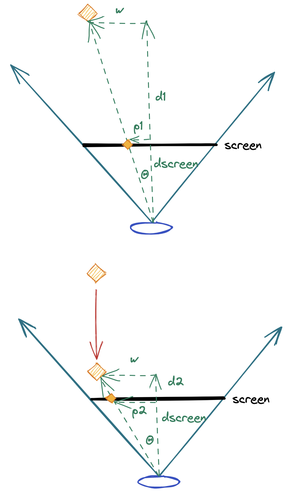
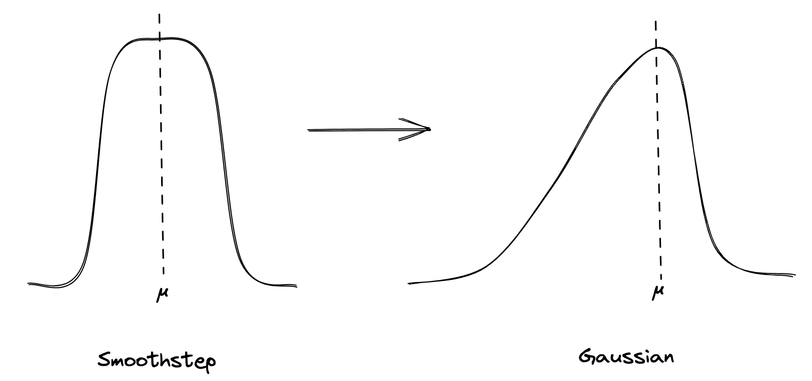
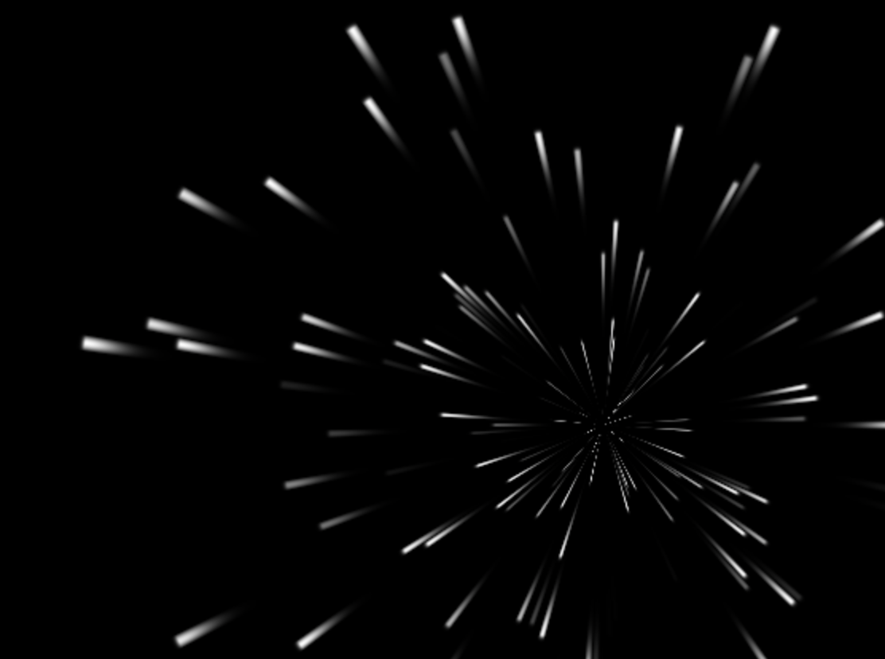
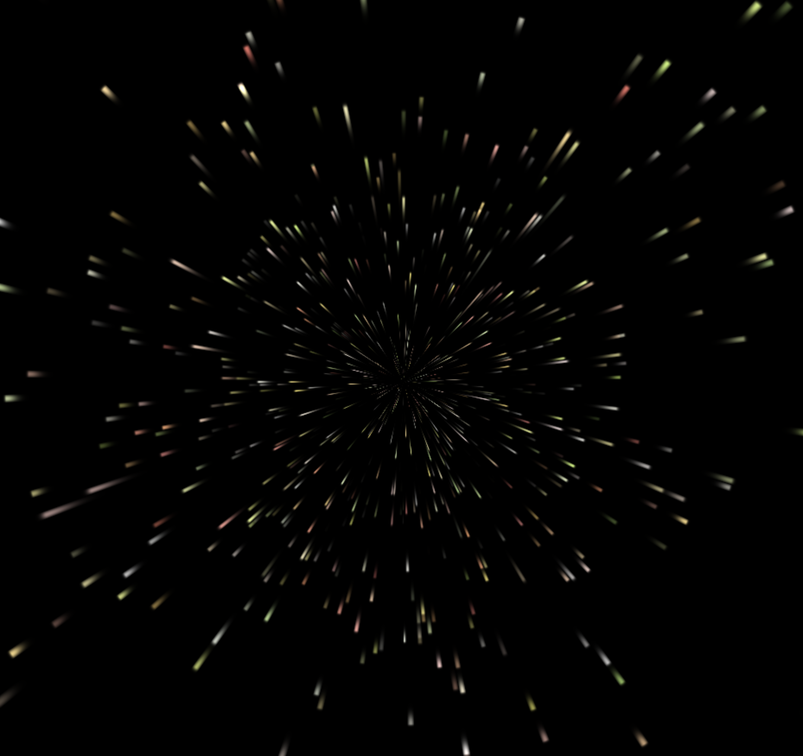

# Radial Starfield

If one wanted to create a simple starfield effect the most simple approach may be to start with a set of stars, loop over them rendering them to the screen. Next frame we update the star positions and draw them again. Start with the star, figure out the pixels to render. But with GLSL the paradigm is reversed: we start with the pixel and need to determine what to render.

While we could track the star positions outside of the shader, that's no fun. We want a shader that only takes the current time as an input. So we need a way to break down the effect - it must look random but it must be deterministic so we can render each frame with no information other than time.

## Approach
The most basic characteristic of a starfield is that stars originate at (near) the center of the screen and appearing to come towards the viewer, radiating outwards. With this in mind, a reasonable approach is to build this effect using polar coordinates with the origin in the center of the screen. Each pixel with location `(x, y)` is converted to a polar coordinate `(r, Θ)` as follows:



In polar coordinates, the movement of a star in a simple starfield can be modeled as a pulse at a constant angle (`Θ`) with radius (`r`) starting at (or near) zero and increasing over time. More specifically, we render the pixels along a ray of constant angle as the output of a function with an impulse at position `µ`.

If we increase `µ` as a function of time we get a pulse radiating out from the center of the screen.



## Step 1

### The Setup

To begin the starfield effect we need to figure out what color to render any given pixel. To do this we first convert our pixel's `(x, y)` coordinate to polar coordinates. Next we must evaluate our pulse function at the radius of the current pixel. We'll start with a simple pulse using GLSL's smoothstep function:

```
float pulseIntensity = smoothstep(u-WIDTH, u, x) - smoothstep(u, u+WIDTH, x);
```

This gives us a "smoothed" pulse of height 1 centered around position `u` with width `WIDTH * 2`.

If we set `u` to 0.5 and evaluate every pixel against our impulse function using its radius, we get a nice fuzzy circle around the origin:



If we instead pass the fractional portion of our time in seconds (scaled by some `SLOWDOWN` factor) such that time is in `[0, 1)` we get a circle that radiates out from the middle, to the edge, disappears, and repeats. The beginning of our effect.

### Perspective

Before we change our radiating circle to be individually radiating stars we need to address the realism of the circle's motion. The circle should look like it starts far away and gets closer over time until we fly though it. But it doesn't. It just grows in size linearly. We need to add 3D perspective.

To fix this we need a bit of math. We start by modeling our universe as an eye looking into the distance with a fixed field of view. Far from the eye is a star and between the eye and the star is our screen. To render the star accurately we need to project its real position in 3D space to a position on the 2D screen.



If...
- `w` is the actual distance of the star from the center of our view;
- `d1` is the actual distance from the eye to the star;
- `dscreen` is the distance from the eye to the screen, and;
- `p1` is the position of the star when projected on the screen

We can use a bit of trig to state that:

$$ tan(Θ) = p1 / dscreen = w / d1  $$
$$ p1 = dscreen * (w / d1) $$

We can repeat the same math for `p2` and generalize the formula for any star. Since `dscreen` is fixed we can just make it a constant `K`. If we're flying in a straight line through a star field, `w` never changes so the projected position is just a function of `1 / d`, or more specifically:

$$ p = (w * K) / d) $$

We'll update the code to calculate the pulse position with this formula. Distance will vary from D1 -> D2 over time, let's say 50 -> 1. We'll pick `w * K` arbitrarily to be 1 for now to get:

```
distance = (1 - time) * 50 + 1
pulsePosition = 1 / distance
```

Updating our code with the above formula gives us a must more realistic perspective, flying through a ring in 3D.

The resulting code for step 1 is available in [step1.html](./step1.html).

## Step 2
Let's turn the ring into stars. There are four things we must do to make to our code in step 1 into an ok first crack at a starfield.

### a - Random distance from center
First, let's change the fixed value of the star's distance from the center, `w`. For each unique radius we'll choose a random `w` which will position the star at each point around the origin a different distance. We'll pull a basic `random` function that gives a deterministic pseudo-random number for a given input and use the polar angle for that input:

```
w = MAX_DISTANCE * random(angle)
pulsePosition = w / distance
```

But running this update gives us what looks like random noise all over the screen! We need our second change.

### b - Quantize the angles
The problem is every pixel on the screen has a unique angle - they may be very close to the same angle, but our random function doesn't care. What we need is to group angular bands of pixels together into a single star. To do this we round the angle of any pixel like so:

```
// Normalize the angle to [0,1]
angle = atan(position.x, position.y) / TWO_PI;
// Round to a presicion of `DENSITY`
angle = floor(angle * DENSITY) / DENSITY;
```

Choosing `DENSITY` of 200 gives and re-running our updated code gives us a pretty great burst of stars flying at the camera!

### c - Random temporal offset
But instead of a constant stream of stars we get a burst of random stars coming at us, disappearing, then restarting. What we need to do is randomize a time offset per star. Instead of all angles getting the same time in `[0, 1]` we give them a unique time:

```
starTime = fract(time + random(angle * 431))
```

(we're multiplying the angle by an arbitrary number here to ensure we get a different random number from the one we used for `w`)

Running this version gives us something that looks pretty good. But we're not done.

### d - Popping in
The last problem we need to solve is that stars "pop" into view before flying towards us. The fix here is easy: simply scale the star intensity by a function of the distance to make it fade in from the distance:

```
outputIntensity *= smoothstep(50., 25., distance);
```

Here we're fading the star in from distance 50 to 25 then leaving it full intensity thereafter.

Update the code and we've got the makings of a pretty good effect in [step2.html](./step2.html)

## Step 3
The effect is looking pretty good but the stars still don't look great - they look like flying bricks. To fix this we need to round them out. First let's address the radial dimension.

Currently we're using a smooth step for our impulse function. This gives us a rounded square. We'll replace this with a function that's more round and steeper on the leading side with a long trailing side:



$$ i = x - u $$
$$ e^{-i^2/P} $$

We'll use a larger `P` when `i < 0` to give a longer tail.



These look ok but we want to apply the same foreshortening that we used for the motion of the star to the length of the tail. So let's reuse our `1 / d` pulse position function to scale the trail length. Looking good.

Next we need to round the radial dimension. When we quantized the pixel's angle to a discrete value we threw away the actual original angle of the pixel. Let's keep it and round the star based on the distance of the current pixel from the "center" angle. A cosine works nicely here. We'll want to round off the star to zero so we'll multiply the angular delta from the center by a constant to scale the delta to `+/- PI/2`.

Now our stars appear rounded, with a nice tail whose length is inversely proportional to distance.

### Colors
We could end the effect here but let's give the stars some color variance. We'll pick random colors (again, based on center angle) using the HSV space:
- `h` randomly pick a hue in the reds/yellows (0 --> 0.25)
- `s` keep the saturation low, so pick in the 0 --> 0.6 range
- `v` stars are bright, keep at 1.0

...and we're done! [step3.html](./step3.html) shows the final effect.

## Next Steps
From here we can play with the density, the speed, the impulse function, the radial rounding, the color function, etc. Maybe we make some stars bigger, or tie the color of the star to it's distance.

We could also address some shortcomings. One issue is that near the center of the screen the effect looks pixelated. This is due to each pixel falling into a single quantized center angle bucket. Things would look better if the pixels blended the contributions of other stars in the vicinity.

Another improvement we could make is to increase star density without making the stars narrower. To do this we render the effect over top of itself in layers, with each layer's stars having unique random seeds. Combining layers with variance in star HSV "value" to make some stars dimmer we get the effect in [step4.html](./step4.html).

