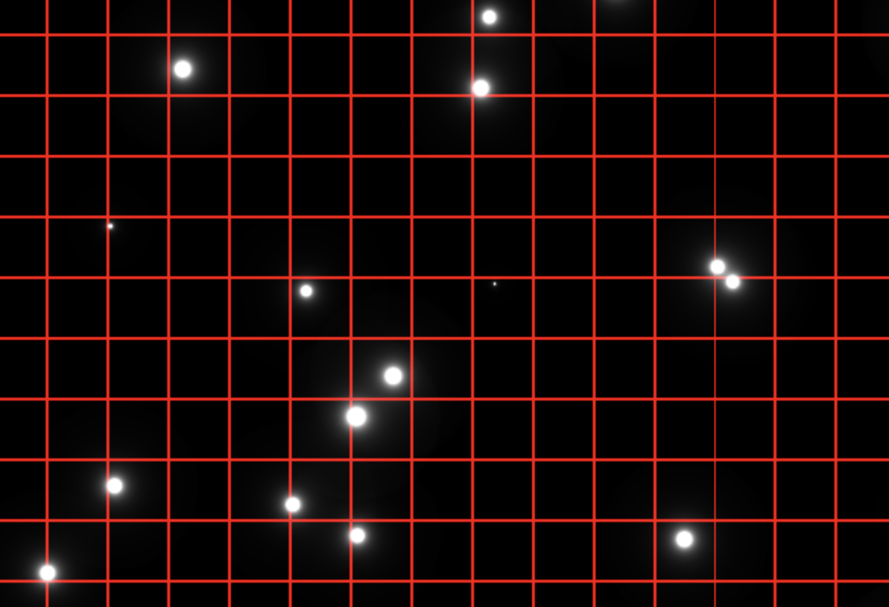

# "Zoomed" Random Image Starfield

## Approach
One way make a classic starfield effect starts with generating a static image of stars. We then take that image and "zoom" into it over time, giving the effect of stars flying towards us. We'll need to create layers of this image to create depth and we'll need to continually create new layers in the distance to make the effect run indefinitely.

## Step 1
Let's start by rendering a static scene of stars and leave the zooming and depth to a later step.

First we need a function that can generate a pseudo-random number given an input coordinate. The function must always return the same value for the same coordinate but otherwise it must appear random. In the radial example we used a function that gave us a random output for a 1-dimensional input. Here we'll need something that will do the same for a 2-dimensional input. Modifying the original function using the dot product to reduce the vector to 1D works well.

If we render our scene using this function as the value for each pixel we get noise:


This doesn't look like stars, we need more empty space than anything else. We need to only render a small percentage of these pixels as stars, the rest space. We can achieve this by only rendering pixels where the random value is greater than some threshold, say `0.98`. Even better, we'll use `smoothstep` to translate random values from `[0.98, 1]` to `[0, 1]` giving us a nice variety of stay brightnesses:


This is ok, but 1-pixel stars of awfully small. Windows 3.1's [starfield screensaver](https://www.youtube.com/watch?v=KheYW_G0goY) uses bigger (albiet chunky) stars, so let's downsample and get bigger stars. We'll use a similar multiply-floor quantization we used in the [radial](../radial/README.md) approach. Beautiful - feels like a [Sierra game](https://www.spacequest.net/misc/fanfiction/fangames/elders1.jpg):


Also see [step1.html](./step1.html)

Now let's add depth.

## Step 2

Making our starfield come towards us is pretty simple: we just scale our pixel coordinate by a `zoom` factor that changes over time:

```
float zoom = 1.0 - fract(u_time * SPEED);
st *= zoom;
```

This works but now we have a single plane of stars that moves in unison. To add depth we need many layers of the star plane, all offset from each other. A `for` loop over a `depth` from 0 to 1 added to our zoom does the trick...almost. Now we have layers moving towards us but each layer is the same. We need each layer to have a different set of random values, so we offset the position in the random field by a function of the layer index.

**TODO layer offset needs to change over time**

Things are starting to look like a starfield, but still pretty clunky. First, the layers furthest away pop into view, and those closest disappear with a pop. We can solve this by fading the stars based on zoom. Second, stars that are further away should look further away - smaller, but also dimmer. Zoom-based fade using `smoothstep` can solve this too.

```
float fade = smoothstep(0.0, 0.1, zoom) - smoothstep(0.5, 1.0, zoom);
pixelValue *= fade;
```

Finally, now that our stars are getting closer to the camera, they're much too big. Let's make them smaller and more sparse by tweaking the quantize and density constants. Nice. [step2.html](./step2.html) is done.

## Step 3
The 90s video game look is pretty great, but let's make the stars look better, less pixelated. One simple approach to this is to change the way we render the pixels that were quantized into square regions. If we take the center of the square star as the true location of the star we can render the pixels differently based on their distance to the center:

```
// Quantize pixels to create stars bigger than pixels
float error = distance(quantizedCoord, originalCoord);
// ...
pixelValue = pixelValue / (STAR_FALLOFF * error);
```

This gives the stars a more realistic appearance. However, with brightness falloff being a function of `1 / x` the haze around the star doesn't go quite to zero and makes the square quantized area visible:


Showing only one layer of stars and adding boundaries makes the issue more apparent:


One easy fix is to use `smoothstep` to ensure the edges of our square region go to zero, hiding the artifacts. This works fairly well - well enough to stop here for [step3.html](./step3.html) and fix this issue in a better way in step 4.

## Step 4
Using `smoothstep` to ensure star rendering didn't spill over the edges of our quantized grid works ok but it limits the size and spread of the star's corona. It also means we have to use a larger grid (and therefore lower star density) to ensure we have space to render the star.

Another approach we can use is for any given pixel, render any contributions from the current quantized grid as well as any of the 8 neighbouring grids:


First, we'll refactor the code to move the star rendering to a function. This will make it easier to render contributions from many stars per pixel. Next, we loop over the neighbouring grid coordinates and render their contribution. With our refactors `renderStar` function this is as easy as wrapping it in a couple of simple loops. We'll adjust the `smoothstep` to have a wider tolerance - we still need to ensure there aren't artifacts at the grid edges. This looks ok.

But there is still one issue with this approach: the stars themselves are positioned in the center of each grid square. This leads to situations where stars are perfectly aligned and gives the effect a very artificial feel:


We can fix this by positioning the star randomly in grid cell. Now that we're rendering the neighbours we don't have to worry about a star being positioned near the edge of a cell and being cut off. To randomly position the star in the cell, we need a function that returns a 2D random number given a 2D input, in our case the cell coordinate. Applying this small change gives us much better results:



I played around with the star falloff, sizing, and zoom fade a little and landed on [step4.html](./step4.html).

